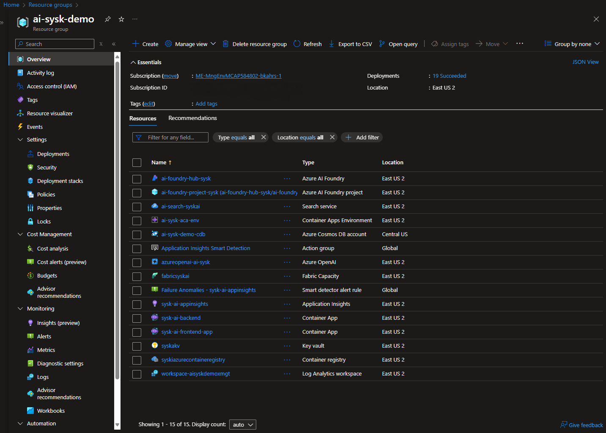

# sysk-podcast-semantic-kernel

This repo aims to create a Semantic Kernel based agent for chatting over Stuff You Should Know podcast episode transcripts. There will be a data ingestion process, a RAG agent, and a front end for users to interface with. Into the future this repo also aims to explore NL2SQL (or GenBI) capabilities as an agent

## Architecture Diagram

## Example Azure Resource Group
